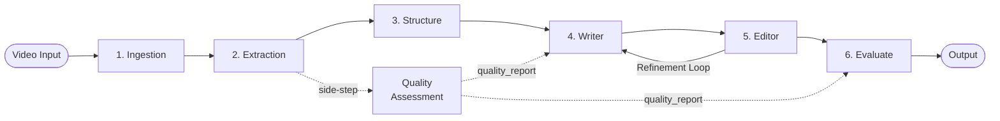

# Architecture Document

## MS Learn Video Documenter Agent

**Version:** 1.0  
**Status:** Draft  
**Last Updated:** 2026-05-09

---

## 1. Architecture Overview

The MS Learn Video Documenter Agent uses a **multi-agent pipeline architecture** orchestrated by the **Microsoft Agent Framework (MAF) v1.0**. The system processes video input through a series of specialized agents, each responsible for a specific phase of the documentation generation workflow.

```
┌─────────────────────────────────────────────────────────────────────┐
│                        USER INTERFACES                              │
│                                                                     │
│   VS Code Chat Participant          Web UI (Future)                 │
│   @video-documenter                  React + Fluent UI              │
│   ┌──────────────────────┐          ┌──────────────────────┐       │
│   │ • File picker        │          │ • Drag-drop upload   │       │
│   │ • Context menu       │          │ • Progress dashboard │       │
│   │ • Chat conversation  │          │ • Side-by-side editor│       │
│   └──────────┬───────────┘          └──────────┬───────────┘       │
│              │                                  │                   │
│              └──────────────┬───────────────────┘                   │
│                             │ REST API                              │
├─────────────────────────────┼───────────────────────────────────────┤
│                    ORCHESTRATION LAYER                               │
│                             │                                       │
│              ┌──────────────▼──────────────┐                       │
│              │   MAF Orchestrator Agent     │                       │
│              │   • Conversation management  │                       │
│              │   • Agent pipeline routing   │                       │
│              │   • Human-in-the-loop control│                       │
│              │   • State checkpointing      │                       │
│              └──────────────┬──────────────┘                       │
│                             │                                       │
├─────────────────────────────┼───────────────────────────────────────┤
│                      AGENT PIPELINE                                 │
│                             │                                       │
│    ┌────────────┐    ┌──────▼─────┐    ┌────────────┐              │
│    │  Ingestion  │───▶│ Extraction │───▶│  Structure  │             │
│    │   Agent     │    │   Agent    │    │   Agent     │             │
│    └────────────┘    └────────────┘    └──────┬─────┘              │
│      ↓ Quality Assessment Agent (side-step after Extraction)        │
│                                               │                     │
│    ┌────────────┐    ┌────────────┐    ┌──────▼─────┐              │
│    │  Evaluate   │◀──│   Editor   │◀──│   Writer    │              │
│    │   Agent     │    │   Agent    │    │   Agent    │              │
│    └────────────┘    └────────────┘    └────────────┘              │
│                                                                     │
├─────────────────────────────────────────────────────────────────────┤
│                       MCP SERVERS                                   │
│                                                                     │
│   ┌──────────────────────────────────────────────────┐              │
│   │ Microsoft Learn MCP Server                       │              │
│   │ https://learn.microsoft.com/api/mcp              │              │
│   │ • microsoft_docs_search                          │              │
│   │ • microsoft_docs_fetch                           │              │
│   │ • microsoft_code_sample_search                   │              │
│   └──────────────────────────────────────────────────┘              │
│                                                                     │
├─────────────────────────────────────────────────────────────────────┤
│                    AZURE AI SERVICES                                │
│                                                                     │
│   ┌──────────────┐  ┌──────────────┐  ┌──────────────┐            │
│   │ Azure AI      │  │ Azure AI     │  │ Azure OpenAI │            │
│   │ Video Indexer │  │ Speech       │  │ (GPT-4o)     │            │
│   └──────────────┘  └──────────────┘  └──────────────┘            │
│   ┌──────────────┐  ┌──────────────┐                               │
│   │ Azure Blob   │  │ Azure AI     │                               │
│   │ Storage      │  │ Foundry      │                               │
│   └──────────────┘  └──────────────┘                               │
│                                                                     │
├─────────────────────────────────────────────────────────────────────┤
│                    LOCAL / FALLBACK SERVICES                         │
│                                                                     │
│   ┌──────────────┐  ┌──────────────┐  ┌──────────────┐            │
│   │ FFmpeg        │  │ PySceneDetect│  │ OpenAI       │            │
│   │ (frames/audio)│  │ (scenes)     │  │ Whisper      │            │
│   └──────────────┘  └──────────────┘  └──────────────┘            │
│   ┌──────────────┐  ┌──────────────┐                               │
│   │ OpenCV        │  │ yt-dlp       │                               │
│   │ (image proc.) │  │ (download)   │                               │
│   └──────────────┘  └──────────────┘                               │
└─────────────────────────────────────────────────────────────────────┘
```

---

## 2. Technology Stack

### 2.1 Core Framework

| Component | Technology | Rationale |
|-----------|-----------|-----------|
| **Agent Framework** | Microsoft Agent Framework (MAF) v1.0 | Microsoft's unified, production-ready successor to Semantic Kernel and AutoGen. Provides graph-based orchestration, human-in-the-loop, checkpointing, streaming, MCP support, and native Foundry hosting. |
| **Language** | Python 3.10+ | Best ecosystem for video/audio processing (FFmpeg, OpenCV, PySceneDetect), ML/AI libraries, and MAF Python SDK. |
| **API Layer** | FastAPI | High-performance async API; serves both VS Code extension and future web UI. |
| **VS Code Extension** | TypeScript + Chat Participant API | VS Code extensions require TypeScript. Extension acts as a thin client calling the Python backend. |
| **MCP Client** | MCP SDK (Python) | Connects agents to external MCP servers for documentation grounding. Supports Streamable HTTP and stdio transports. |

### 2.2 Azure Services (Cloud Mode)

| Service | Purpose | Fallback |
|---------|---------|----------|
| **Azure AI Foundry** | Model hosting (GPT-4o, GPT-4o-mini, Phi-4) | Direct OpenAI API |
| **Azure AI Video Indexer** | Full video analysis (scenes, keyframes, OCR, transcript, entities) | FFmpeg + PySceneDetect + Whisper |
| **Azure AI Speech** | Fast transcription with diarization | OpenAI Whisper (local or Azure-hosted) |
| **Azure OpenAI (GPT-4o Vision)** | Keyframe semantic analysis, UI state interpretation, document generation | — |
| **Azure Blob Storage** | Video file staging, keyframe image storage | Local filesystem |
| **Azure Container Apps** | Backend hosting (production) | Local Docker / dev server |
| **Microsoft Learn MCP Server** | Documentation search, fetch, and code sample retrieval for agent grounding | Local fallback: embedded style rules only (no live grounding) |

### 2.3 Local / Open-Source Components

| Component | Purpose | License | Containerizable |
|-----------|---------|---------|-----------------|
| **FFmpeg** | Frame extraction, audio extraction, scene change detection | LGPL | ✅ |
| **PySceneDetect** | Adaptive scene boundary detection | BSD-3 | ✅ |
| **OpenCV** | Image processing, SSIM comparison, template matching | Apache-2.0 | ✅ |
| **OpenAI Whisper** | Local speech-to-text transcription | MIT | ✅ |
| **yt-dlp** | YouTube/Stream video download | Unlicense | ✅ |
| **Pillow** | Image annotation (step numbers, highlights) | MIT-like | ✅ |
| **Copilot LM Proxy** | Local-mode LLM access via VS Code Language Model API | — | N/A (requires VS Code) |

### 2.4 Copilot LM Proxy (local mode)

**Purpose:** Eliminates the Azure AI Foundry credential requirement for local development by routing LLM calls through the user's existing GitHub Copilot subscription via the VS Code Language Model API.

#### How it works

```
┌──────────────────────────────────────────────────────────────┐
│                      VS Code Extension                        │
│                                                               │
│  Chat Participant ──▶ BackendClient ──HTTP──┐                 │
│                                             │                 │
│  LM Proxy Server (localhost:PORT)           │                 │
│    POST /v1/chat/completions     ◀──────────┘                 │
│    GET  /health                                               │
│      │                                                        │
│      ├── vscode.lm.selectChatModels() → GPT-4o etc.          │
│      └── model.sendRequest(messages) → streaming text         │
│                                                               │
└──────────────────────┬────────────────────────────────────────┘
                       │ HTTP (localhost, local mode only)
                       │
┌──────────────────────┴────────────────────────────────────────┐
│                 Python Backend (local mode)                     │
│                                                                │
│  Orchestrator → create_llm_client()                            │
│    ├── if use_copilot_proxy → CopilotProxyChatClient           │
│    │     (OpenAI-compat HTTP to LM Proxy)                      │
│    └── else → FoundryChatClient (Azure AI Foundry)             │
│                                                                │
│  POST /api/v1/config/lm-proxy                                 │
│    (receives proxy URL from extension on startup)              │
│                                                                │
└────────────────────────────────────────────────────────────────┘
```

1. **Extension starts proxy:** The VS Code extension launches an HTTP server (`lmProxyServer.ts`) on a random available port, exposing an OpenAI-compatible `POST /v1/chat/completions` endpoint.
2. **Handshake:** The extension sends the proxy URL to the backend via `POST /api/v1/config/lm-proxy`. The backend stores it in `Settings.copilot_proxy_url`.
3. **Orchestrator routing:** `create_llm_client()` checks `Settings.use_copilot_proxy`. If the proxy URL is set and the mode is `local`, it returns a `CopilotProxyChatClient`; otherwise it falls back to `FoundryChatClient`.
4. **Request translation:** The proxy server translates OpenAI-format requests into `vscode.lm` API calls (`selectChatModels()` → `sendRequest()`), streaming the response back as standard SSE chunks.

#### Configuration

| Setting | Location | Description |
|---------|----------|-------------|
| `copilot_proxy_url` | Backend `Settings` | Set automatically via handshake; e.g. `http://localhost:54321` |
| `copilot_proxy_model` | Backend `Settings` | Model name to request from Copilot (default: `copilot-auto`) |
| `use_copilot_proxy` | Backend `Settings` (computed) | `True` when `processing_mode == "local"` and `copilot_proxy_url` is set |
| `useCopilotModels` | Extension `settings.json` | User-facing toggle to enable/disable the LM Proxy |

#### Limitations

- **Rate limits:** Subject to GitHub Copilot rate limits, which vary by subscription tier.
- **Model availability:** Available models depend on the user's Copilot subscription and what VS Code exposes via `vscode.lm`.
- **Extension dependency:** The VS Code extension must be running for the proxy to be available; the backend cannot use Copilot models headlessly.
- **Local mode only:** The proxy is not used in cloud/production mode — Azure AI Foundry is used instead.

---

## 3. Agent Pipeline Detail

### 3.1 Agent Roles

The pipeline follows a design inspired by **Doc-Kit** (Microsoft Foundry's internal 4-agent documentation pipeline) adapted for video-first content.



#### Agent 1: Ingestion Agent

**Responsibility:** Accept video from any source and prepare it for processing.

| Input | Processing | Output |
|-------|-----------|--------|
| Local file path | Validate format, upload to Azure Blob | Blob SAS URL |
| Azure Blob URL | Validate accessibility | Blob SAS URL |
| YouTube/Stream URL | Download via yt-dlp, upload to Blob | Blob SAS URL |

```python
# Pseudocode
class IngestionAgent:
    async def process(self, video_source: str) -> IngestionResult:
        source_type = self.detect_source_type(video_source)
        
        if source_type == "local_file":
            blob_url = await self.upload_to_blob(video_source)
        elif source_type == "blob_url":
            blob_url = self.validate_sas_url(video_source)
        elif source_type == "youtube" or source_type == "stream":
            local_path = await self.download_video(video_source)
            blob_url = await self.upload_to_blob(local_path)
        
        return IngestionResult(blob_url=blob_url, metadata=self.extract_metadata())
```

#### Agent 2: Extraction Agent

**Responsibility:** Extract structured data from the video (transcript, keyframes, OCR, scenes).

**Two processing modes:**

| Mode | Services Used | Cost | Best For |
|------|--------------|------|----------|
| **Cloud (default)** | Azure Video Indexer | Per-minute billing | Production, highest quality |
| **Local** | FFmpeg + PySceneDetect + Whisper + OpenCV | Free (compute only) | Development, cost-sensitive |

**Cloud Mode Pipeline:**
```
Video (Blob URL)
    │
    ▼
Azure Video Indexer
    ├── Transcript (timestamped, speaker-attributed)
    ├── Scenes (semantic groupings with start/end times)
    ├── Shots (visual transitions)
    ├── Keyframes (stable frames per shot, with thumbnailIds)
    ├── OCR (on-screen text with bounding boxes + timestamps)
    ├── Labels (detected objects/actions)
    └── Named Entities (brands, products from text + speech)
    │
    ▼
GPT-4o Vision (per keyframe)
    └── UI State Description (what the user sees, what action is being performed)
```

**Local Mode Pipeline:**
```
Video File
    │
    ├── FFmpeg ──▶ Audio Track (.wav)
    │                 └── Whisper ──▶ Timestamped Transcript
    │
    ├── PySceneDetect ──▶ Scene Boundaries (timestamps)
    │
    ├── FFmpeg ──▶ Keyframes at Scene Changes (.png)
    │                 ├── OpenCV OCR / Azure Vision OCR ──▶ On-Screen Text
    │                 └── GPT-4o Vision ──▶ UI State Description
    │
    └── Combined Output: ExtractionResult
```

**Output Schema:**
```python
@dataclass
class ExtractionResult:
    transcript: list[TranscriptSegment]    # text, start, end, speaker
    scenes: list[Scene]                     # id, start, end, keyframes
    keyframes: list[Keyframe]               # id, timestamp, image_path, ocr_text, ui_description
    ocr_entries: list[OCREntry]             # text, timestamp, bounding_box
    entities: list[Entity]                  # name, type, mentions
    video_metadata: VideoMetadata           # duration, resolution, fps
```

#### Quality Assessment Agent (side-step)

**Responsibility:** LLM-based evaluation of extraction data quality and grounding potential. Called via a dedicated API endpoint — runs as a non-blocking side-step after Extraction, not inline in the pipeline.

| Input | Processing | Output |
|-------|-----------|--------|
| `ExtractionResult` | Sends extraction data to GPT-4o with quality assessment prompt | `DataQualityReport` |

**Quality levels:**

| Level | Description |
|-------|-------------|
| `rich` | Comprehensive transcript, keyframes, OCR — ideal for generation |
| `adequate` | Sufficient data for most document types |
| `thin` | Limited data; Writer Agent applies guardrails (shorter output, hedged language, gap notifications) |
| `minimal` | Insufficient for reliable generation; user is warned |

```python
@dataclass
class DataQualityReport:
    quality_level: Literal["rich", "adequate", "thin", "minimal"]
    transcript_assessment: str    # Qualitative assessment of transcript quality and completeness
    visual_assessment: str        # Qualitative assessment of keyframe/OCR quality
    coverage_gaps: list[str]      # Topics or steps with insufficient extraction data
    warnings: list[str]           # Issues that may affect generation quality
    recommendations: list[str]    # Actions to improve data quality before generation
    grounding_confidence: float   # 0.0–1.0: confidence that generated content can be grounded
    raw_metrics: dict             # Quantitative extraction metrics (word count, frame count, etc.)
```

**When called:** Via `POST /api/v1/videos/{video_id}/assess-quality`. The `DataQualityReport` is cached on the video job and passed to the Writer Agent (thin-data guardrails) and the Evaluate Agent (grounding dimension scoring).

#### Agent 3: Structure Agent

**Responsibility:** Map extracted content to an MS Learn document structure.

This agent:
1. **Asks the user** which document type to produce (Quickstart, Tutorial, How-to, Concept, Overview)
2. **Asks what supplementary materials** are available (README, API specs, existing docs)
3. **Creates a document outline** by mapping transcript + keyframes to the template structure
4. **Identifies logical steps** from scene transitions + narration

```python
class StructureAgent:
    async def process(self, extraction: ExtractionResult, 
                      doc_type: str, context: dict) -> DocumentOutline:
        # Load MS Learn template for doc_type
        template = self.load_template(doc_type)
        
        # Cluster scenes into logical steps
        steps = self.identify_steps(extraction.scenes, extraction.transcript)
        
        # Map steps to template sections
        outline = self.map_to_template(steps, template)
        
        # Select best keyframe per step for screenshots  
        outline.screenshots = self.select_screenshots(steps, extraction.keyframes)
        
        return outline
```

#### Agent 4: Writer Agent

**Responsibility:** Generate the full Markdown document from the outline.

Uses GPT-4o with a carefully crafted system prompt that encodes:
- MS Learn voice and tone principles
- Document-type-specific formatting rules
- YAML frontmatter requirements
- MS Learn Markdown extension syntax
- Thin-data guardrails when `DataQualityReport.quality_level` is `thin` or `minimal` (shorter output, hedged language, explicit coverage gap notifications)

```python
WRITER_SYSTEM_PROMPT = """
You are a Microsoft Learn documentation writer. Generate content following these rules:

VOICE AND TONE:
- Focus on what the customer is trying to do
- Use everyday words; be friendly with contractions (it's, you'll, you're)
- Write concisely — short sentences, no wasted words
- Make content scannable — most important things first
- Show empathy — supportive tone

FORMATTING:
- Sentence case for all headings (never title case)
- Serial/Oxford comma in all lists
- Use "sign in" not "log in"
- No gerunds in H1
- Don't number H2 sections
- Max 12 steps per procedure
- Use :::image type="content" source="..." alt-text="..."::: for images
- Use > [!NOTE], > [!TIP], > [!IMPORTANT] for callouts (max 1-2 per article)
...
"""
```

#### Agent 5: Editor Agent

**Responsibility:** Refine the generated document for quality, consistency, and style compliance.

The Editor Agent:
- Checks document against MS Learn style rules
- Fixes grammar, tone, and formatting issues
- Ensures screenshot alt-text is descriptive
- Validates YAML frontmatter completeness
- Handles user feedback for iterative refinement

#### Agent 6: Evaluate Agent

**Responsibility:** Quality-gate the final document (inspired by Doc-Kit's Evaluate Agent).

Scores the document on:
- **Completeness:** Are all video steps represented? (0.0–1.0)
- **Technical Accuracy:** Does text match what's shown in video? (0.0–1.0)
- **Style Compliance:** Does it follow MS Learn voice/tone? (0.0–1.0)
- **Readability:** Is it scannable, concise, well-structured? (0.0–1.0)
- **Grounding:** Is document content traceable to extraction evidence? (0.0–1.0)

```python
class EvaluateAgent:
    async def evaluate(self, document: str, extraction: ExtractionResult,
                       quality_report: DataQualityReport | None = None) -> EvaluationReport:
        scores = {
            "completeness": await self.check_completeness(document, extraction),
            "accuracy": await self.check_accuracy(document, extraction),
            "style": await self.check_style(document),
            "readability": await self.check_readability(document),
            "grounding": await self.check_grounding(document, extraction, quality_report)
        }
        
        overall = sum(scores.values()) / len(scores)  # average of 5 dimensions
        passed = overall >= 0.7 and all(s >= 0.5 for s in scores.values())
        
        return EvaluationReport(scores=scores, overall=overall, passed=passed,
                                suggestions=self.generate_suggestions(scores))
```

### 3.2 MCP Tool Integration

The Structure, Writer, and Editor agents use tools from the Microsoft Learn MCP Server to ground their output in published MS Learn content.

**MCP Server:** Microsoft Learn (`https://learn.microsoft.com/api/mcp`)  
**Transport:** Streamable HTTP (production), stdio (local development via `MicrosoftDocs/mcp` repo)

| MCP Tool | Used By | Purpose |
|----------|---------|---------|
| `microsoft_docs_search` | Structure, Writer, Editor | Search MS Learn index for related published articles |
| `microsoft_docs_fetch` | Writer, Editor | Fetch full article content for voice/tone reference |
| `microsoft_code_sample_search` | Writer | Find official code samples for inclusion |

**Integration flow:**

```
Agent Processing Step
    │
    ├── Agent determines topic/service from extraction data
    ├── Calls microsoft_docs_search for related articles
    ├── Selects most relevant result
    ├── Calls microsoft_docs_fetch for full content
    ├── Extracts voice/tone/structure patterns (truncated to token budget)
    └── Uses patterns to ground generated output
```

**Graceful degradation:** If the MCP server is unavailable, agents fall back to embedded MS Learn style rules in their system prompts. A warning is logged but processing continues.

**Caching:** MCP responses are cached with configurable TTL (default: 1 hour) to reduce latency and avoid rate limits.

---

## 4. VS Code Extension Architecture

### 4.1 Extension Structure

```
vscode-video-documenter/
├── package.json                  # Extension manifest + chat participant registration
├── src/
│   ├── extension.ts              # Activation, participant registration
│   ├── chatHandler.ts            # Chat request handler (main interaction loop)
│   ├── commands/
│   │   ├── analyzeFile.ts        # File picker → start analysis
│   │   └── openReport.ts         # Open generated docs
│   ├── api/
│   │   └── backendClient.ts      # HTTP client to Python backend
│   └── utils/
│       ├── fileDetection.ts      # Parse file paths from user input
│       └── progress.ts           # Progress stream helpers
├── media/
│   └── icon.png
└── tsconfig.json
```

### 4.2 Extension activation lifecycle

When the extension activates, it orchestrates the full startup sequence:

1. **Register chat participant** — `@video-documenter` becomes available immediately
2. **Start Python backend** — spawns `python -m src.main` as a child process (if `autoStartBackend` is enabled)
3. **Health check** — polls `GET /api/v1/health` every 500ms until the backend responds (30s timeout)
4. **Start LM Proxy** — creates an OpenAI-compatible HTTP server backed by Copilot models
5. **Connect** — notifies the backend of the LM Proxy URL via `POST /api/v1/config/lm-proxy`

The extension detects if a backend is already running on the configured port and skips spawning in that case, allowing developers to run the backend manually for debugging.

### 4.3 Chat Participant Registration

```json
{
  "contributes": {
    "chatParticipants": [{
      "id": "video-documenter.agent",
      "name": "video-documenter",
      "fullName": "MS Learn Video Documenter",
      "description": "Analyzes screen recordings and generates MS Learn documentation",
      "isSticky": true,
      "commands": [
        { "name": "analyze", "description": "Analyze a screen recording video" },
        { "name": "generate", "description": "Generate documentation from analyzed video" },
        { "name": "refine", "description": "Refine a section of generated documentation" }
      ]
    }]
  }
}
```

### 4.4 Video File Input Patterns

Since VS Code Chat has no native video upload, three input patterns are supported:

| Pattern | Trigger | Implementation |
|---------|---------|----------------|
| **Chat prompt** | `@video-documenter analyze C:\recordings\demo.mp4` | Parse path from `request.prompt` |
| **Context menu** | Right-click .mp4 in Explorer → "Analyze with Video Documenter" | Register `menus.explorer/context` command |
| **File picker** | `@video-documenter /analyze` (no path) | Invoke `vscode.window.showOpenDialog()` with video filters |

### 4.5 Companion Extensions

The Video Documenter extension integrates with three companion VS Code extensions that enhance the documentation workflow:

| Extension | ID | Availability | Role |
|-----------|-----|-------------|------|
| **Learn Authoring Pack** | `docsmsft.docs-authoring-pack` | Public | MS Learn Markdown syntax, preview, YAML validation, templates |
| **Content Mentor** | `msft-content.content-mentor` | Microsoft-internal | AI-powered style enforcement, metadata optimization, `@content-mentor` chat participant |
| **Learn Authoring Assistant** | `docsmsft.learn-authoring-assistant` | Microsoft-internal | AI writing style reviewer, `/suggestEdits` in Copilot Chat |

**Integration model:** Companion workflow (not programmatic API calls). The extension detects installed companions and provides contextual post-generation guidance.

```
Document Generated
    │
    ├── Learn Authoring Pack installed?
    │   └── Yes → Offer Learn Preview side-by-side
    │
    ├── Content Mentor installed?
    │   └── Yes → Suggest "@content-mentor" for AI review
    │
    └── Authoring Assistant installed?
        └── Yes → Suggest "/suggestEdits" for style review
```

Learn Authoring Pack is registered as an `extensionDependencies` in `package.json` (public, recommended for all users). Content Mentor and Learn Authoring Assistant are Microsoft-internal only — detected but never recommended to external users.

---

## 5. Backend Architecture

### 5.1 Project Structure

```
backend/
├── pyproject.toml                    # Python project config (uv/pip)
├── src/
│   ├── main.py                       # FastAPI app entry point
│   ├── config.py                     # Environment configuration
│   ├── agents/
│   │   ├── orchestrator.py           # MAF orchestrator (pipeline routing)
│   │   ├── ingestion.py              # Video ingestion agent
│   │   ├── extraction.py             # Video analysis agent
│   │   ├── quality.py                # Data quality assessment agent (side-step)
│   │   ├── structure.py              # Document structure agent
│   │   ├── writer.py                 # Content generation agent
│   │   ├── editor.py                 # Refinement agent
│   │   └── evaluate.py               # Quality evaluation agent
│   ├── services/
│   │   ├── blob_storage_service.py   # Azure Blob Storage client (cloud mode)
│   │   ├── copilot_client.py         # Copilot LM Proxy client (local mode)
│   │   ├── ffmpeg_service.py         # FFmpeg wrapper (local mode)
│   │   ├── intent_classifier.py      # User message intent classification
│   │   ├── scene_detection_service.py # PySceneDetect wrapper (local mode)
│   │   ├── speech_service.py         # Azure AI Speech Fast Transcription (cloud mode)
│   │   ├── video_indexer_service.py  # Azure Video Indexer client (cloud mode)
│   │   ├── vision_service.py         # GPT-4o Vision analysis
│   │   └── whisper_service.py        # OpenAI Whisper transcription (local mode)
│   ├── templates/
│   │   ├── quickstart.md             # MS Learn Quickstart template
│   │   ├── tutorial.md               # MS Learn Tutorial template
│   │   ├── howto.md                  # MS Learn How-to template
│   │   ├── concept.md                # MS Learn Concept template
│   │   └── overview.md               # MS Learn Overview template
│   ├── prompts/
│   │   ├── writer_system.md          # Writer agent system prompt
│   │   ├── editor_system.md          # Editor agent system prompt
│   │   ├── evaluate_system.md        # Evaluate agent system prompt
│   │   ├── structure_system.md       # Structure agent system prompt
│   │   └── quality_system.md         # Quality Assessment agent system prompt
│   ├── models/
│   │   ├── video.py                  # Video/extraction data models
│   │   ├── document.py               # Document/outline data models
│   │   ├── evaluation.py             # Evaluation report models
│   │   └── services.py               # Azure service slug list
│   └── api/
│       ├── routes.py                 # API route definitions
│       └── websocket.py              # WebSocket for streaming progress
├── tests/
│   ├── test_agents/
│   ├── test_services/
│   └── fixtures/
├── Dockerfile                        # Container build
└── docker-compose.yml                # Local development stack
```

### 5.2 API Endpoints

```
POST   /api/v1/videos/ingest                    # Upload/register video
GET    /api/v1/videos/{id}/status               # Check processing status; includes data_quality when assessed
GET    /api/v1/videos/{id}/extraction           # Get extraction results
POST   /api/v1/videos/{id}/assess-quality       # Assess extraction data quality; returns DataQualityReport
POST   /api/v1/documents/generate               # Generate document from extraction
POST   /api/v1/documents/{id}/refine            # Iterative refinement
GET    /api/v1/documents/{id}                   # Get generated document
POST   /api/v1/classify-intent                  # Classify user message intent (save/refine/general)
WS     /ws/progress/{video_id}                  # Step-based progress streaming (fire-and-forget)
```

#### WebSocket Progress Payload

Progress is **step-based** (not percentage-based). The `send_progress` method is fire-and-forget via `asyncio.create_task` — it never blocks the pipeline.

```json
{
  "type": "progress",
  "video_id": "abc123",
  "stage": "extracting",
  "step": 2,
  "total_steps": 6,
  "detail": "Step 2/6: Extracting transcript, scenes, and keyframes..."
}
```

Pipeline steps: 1=Ingestion, 2=Extraction, 3=Structure, 4=Writer, 5=Editor, 6=Evaluate.

### 5.3 Configuration

```python
# config.py - Environment-based configuration
class Settings(BaseSettings):
    # Processing mode
    processing_mode: Literal["cloud", "local"] = "cloud"
    
    # Azure AI Foundry
    azure_openai_endpoint: str
    azure_openai_api_key: str
    azure_openai_deployment: str = "gpt-4o"
    
    # Azure Video Indexer (cloud mode)
    video_indexer_account_id: str = ""
    video_indexer_resource_id: str = ""
    
    # Azure Speech (cloud mode)
    speech_service_endpoint: str = ""
    speech_service_region: str = "eastus"
    
    # Azure Blob Storage
    blob_account_url: str = ""
    blob_container_name: str = "video-documenter"
    
    # Local mode settings
    whisper_model: str = "base"  # tiny, base, small, medium, large
    ffmpeg_path: str = "ffmpeg"
    
    # Copilot LM Proxy (local mode — set via handshake, see §2.4)
    copilot_proxy_url: str = ""       # e.g. http://localhost:54321
    copilot_proxy_model: str = "copilot-auto"
    # use_copilot_proxy is a computed property:
    #   True when processing_mode == "local" and copilot_proxy_url is set
    
    # MCP Settings
    mcp_enabled: bool = True
    mslearn_mcp_endpoint: str = "https://learn.microsoft.com/api/mcp"
    mcp_cache_ttl_seconds: int = 3600
    
    # Output
    output_directory: str = "./output"
```

### 5.4 Data models

Key data models are defined in `backend/src/models/`:

| Model | File | Description |
|-------|------|-------------|
| `ExtractionResult` | `video.py` | Transcript, scenes, keyframes, OCR, entities from video analysis |
| `DocumentOutline` | `document.py` | Structured outline mapping video content to MS Learn template |
| `EvaluationReport` | `evaluation.py` | 5-dimension quality scores + overall + pass/fail decision |
| `DataQualityReport` | `quality.py` | Extraction data quality assessment; feeds Writer guardrails and Evaluate grounding |

`EvaluationReport.overall` is the average of all 5 scoring dimensions. `EvaluationReport.passed` is `True` when `overall >= 0.7` and all individual dimensions score `>= 0.5`.

---

## 6. Data Flow

### 6.1 End-to-End Processing Flow

```
1. USER: @video-documenter analyze C:\recordings\demo.mp4

2. VS CODE EXTENSION:
   ├── Parse file path from prompt
   ├── Read video file bytes
   └── POST /api/v1/videos/ingest (multipart upload)

3. INGESTION AGENT:
   ├── Validate video format and size
   ├── Upload to Azure Blob Storage
   └── Return: { video_id, blob_url, metadata }

4. EXTRACTION AGENT (Cloud Mode):
   ├── Submit to Azure Video Indexer
   ├── Poll for completion (~2-4 min for 10-min video)
   ├── Retrieve insights JSON (transcript, scenes, keyframes, OCR)
   ├── Download keyframe images
   ├── For each keyframe: call GPT-4o Vision for UI analysis
   └── Return: ExtractionResult

4a. QUALITY ASSESSMENT (optional, via separate API call):
    ├── POST /api/v1/videos/{id}/assess-quality
    ├── LLM evaluates ExtractionResult for quality and grounding potential
    └── Return: DataQualityReport (quality_level, grounding_confidence, coverage_gaps, ...)

5. ORCHESTRATOR → USER:
   └── "Video analyzed! I found 8 scenes and 15 key steps.
        What type of MS Learn document would you like?
        1. Quickstart  2. Tutorial  3. How-to  4. Concept  5. Overview"

6. USER: "Tutorial please. I also have a README with prerequisites."

7. STRUCTURE AGENT:
   ├── Load Tutorial template
   ├── Cluster 15 steps into logical sections
   ├── Map to: Prerequisites → Step sections → Clean up → Next steps
   ├── Select best screenshot per section
   └── Return: DocumentOutline

8. WRITER AGENT:
   ├── Generate YAML frontmatter
   ├── Write each section using MS Learn voice/tone
   ├── Insert screenshots with :::image::: syntax
   ├── Add appropriate callouts (> [!NOTE], > [!TIP])
   ├── Apply thin-data guardrails if DataQualityReport.quality_level is thin or minimal
   └── Return: Full Markdown document

9. EDITOR AGENT:
   ├── Check style compliance
   ├── Fix grammar and formatting
   ├── Validate frontmatter
   └── Return: Edited Markdown

10. EVALUATE AGENT:
    ├── Score: completeness=0.92, accuracy=0.88, style=0.95, readability=0.90, grounding=0.87
    └── Return: EvaluationReport (PASSED, overall=0.90)

11. ORCHESTRATOR → USER:
    ├── Stream document preview in chat
    ├── Save .md file + screenshots to output directory
    └── "Document generated! Quality score: 91%. Would you like to refine any section?"

12. USER: "The Prerequisites section should mention Node.js 18+"

13. EDITOR AGENT (refinement):
    ├── Update Prerequisites section only
    └── Return: Updated document

14. Output files:
    ├── tutorial-product-demo.md
    └── media/
        ├── step-01-sign-in.png
        ├── step-02-create-resource.png
        └── ...
```

---

## 7. Deployment Architecture

### 7.1 Local Development

```
┌─────────────────────────────────────┐
│           Developer Machine          │
│                                     │
│  VS Code                            │
│  ├── Video Documenter Extension     │
│  │   ├── @video-documenter chat     │
│  │   └── LM Proxy Server (:PORT)   │
│  │        (OpenAI-compat endpoint)  │
│  │                                  │
│  └── Terminal                       │
│      └── Python Backend (FastAPI)   │
│          ├── FFmpeg (local)         │
│          ├── PySceneDetect (local)  │
│          └── Whisper (local, opt.)  │
│                                     │
│  ─── Calls ──▶ Azure AI Foundry    │
│                (GPT-4o only)        │
│  ─── OR ────▶ LM Proxy → Copilot  │
│                (no Azure creds)     │
└─────────────────────────────────────┘
```

In local mode:
- Only Azure AI Foundry (GPT-4o) requires a cloud connection — **or** the Copilot LM Proxy can be used instead (see §2.4), eliminating Azure credentials entirely
- Video processing uses FFmpeg + PySceneDetect locally
- Transcription can use local Whisper or Azure Speech
- No Azure Blob Storage needed (files stay on disk)

### 7.2 Azure Production Deployment

```
┌─────────────────────────────────────────────────────────────────┐
│                        Azure Cloud                               │
│                                                                  │
│  ┌──────────────────┐     ┌──────────────────────────────────┐  │
│  │ Azure Container  │     │    Azure AI Services              │  │
│  │ Apps             │     │                                   │  │
│  │                  │     │  ┌─────────────┐  ┌───────────┐  │  │
│  │  FastAPI Backend │────▶│  │ AI Foundry  │  │ Video     │  │  │
│  │  + FFmpeg        │     │  │ (GPT-4o)    │  │ Indexer   │  │  │
│  │  + PySceneDetect │     │  └─────────────┘  └───────────┘  │  │
│  │                  │     │  ┌─────────────┐  ┌───────────┐  │  │
│  └──────────────────┘     │  │ AI Speech   │  │ Blob      │  │  │
│                           │  │             │  │ Storage   │  │  │
│                           │  └─────────────┘  └───────────┘  │  │
│                           └──────────────────────────────────┘  │
│                                                                  │
│  ┌──────────────────┐                                           │
│  │ Azure Foundry    │  (Alternative: host MAF agents directly)  │
│  │ Agent Service    │                                           │
│  └──────────────────┘                                           │
└─────────────────────────────────────────────────────────────────┘
```

### 7.3 Container Specification

```dockerfile
# Dockerfile
FROM python:3.12-slim

# Install FFmpeg
RUN apt-get update && apt-get install -y ffmpeg && rm -rf /var/lib/apt/lists/*

# Install Python dependencies
COPY pyproject.toml .
RUN pip install --no-cache-dir .

# Copy application
COPY src/ ./src/

EXPOSE 8000
CMD ["uvicorn", "src.main:app", "--host", "0.0.0.0", "--port", "8000"]
```

---

## 8. Model Selection Strategy

### 8.1 Model Routing

Different agents use different models based on task requirements:

| Agent | Recommended Model | Fallback Model | Rationale |
|-------|------------------|----------------|-----------|
| **Extraction (Vision)** | GPT-4o | GPT-4o-mini | Vision tasks need highest quality |
| **Quality Assessment** | GPT-4o | GPT-4o-mini | Grounding assessment requires strong reasoning |
| **Structure** | GPT-4o-mini | Phi-4 | Lightweight reasoning task |
| **Writer** | GPT-4o | GPT-4o-mini | Complex creative generation |
| **Editor** | GPT-4o-mini | Phi-4 | Targeted edits, lower complexity |
| **Evaluate** | GPT-4o | GPT-4o-mini | Quality assessment needs strong reasoning |

### 8.2 Token Budget Estimation (10-minute video)

| Step | Input Tokens | Output Tokens | Model |
|------|-------------|---------------|-------|
| Vision analysis (15 frames) | ~15,000 | ~3,000 | GPT-4o |
| Document generation | ~8,000 | ~4,000 | GPT-4o |
| Editing pass | ~5,000 | ~4,000 | GPT-4o-mini |
| Evaluation | ~5,000 | ~1,000 | GPT-4o |
| **Total** | **~33,000** | **~12,000** | — |

Estimated cost per 10-minute video: ~$0.15–0.30 (Azure OpenAI pricing)

---

## 9. MS Learn Template System

### 9.1 Template Loading

Templates are sourced from `MicrosoftDocs/content-templates` and embedded in the agent:

```python
TEMPLATES = {
    "quickstart": {
        "h1_format": "Quickstart: {verb} {noun}",
        "intro_format": "In this quickstart, you {action}.",
        "required_sections": ["Prerequisites", "Clean up resources", "Next step"],
        "ms_topic": "quickstart"
    },
    "tutorial": {
        "h1_format": "Tutorial: {verb} {noun}",
        "intro_format": "{1-3 paragraph motivation}",
        "required_sections": ["Prerequisites", "Clean up resources", "Next step"],
        "includes_checklist": True,
        "ms_topic": "tutorial"
    },
    "how-to": {
        "h1_format": "{verb} {noun}",
        "required_sections": ["Prerequisites", "Next step"],
        "ms_topic": "how-to"
    },
    "concept": {
        "h1_format": "What is {noun}?" or "{noun} overview",
        "no_numbered_steps": True,
        "ms_topic": "concept-article"
    },
    "overview": {
        "h1_format": "What is {product}?",
        "no_numbered_steps": True,
        "ms_topic": "overview"
    }
}
```

### 9.2 Screenshot Annotation Pipeline

```
Keyframe Image (from video)
    │
    ├── OCR: Extract UI text (button labels, menu items)
    ├── GPT-4o Vision: Identify key UI elements and actions
    │
    ▼
Annotation Engine (Pillow/OpenCV):
    ├── Add step number badge (red circle with white number)
    ├── Highlight relevant UI element (red rectangle)
    ├── Add caption below image
    │
    ▼
Output: annotated-step-{N}.png + alt-text string
```

---

## 10. Security Considerations

| Concern | Mitigation |
|---------|------------|
| Video files may contain sensitive content | Process locally when possible; use Blob Storage with SAS tokens (time-limited); no permanent video storage |
| Azure API keys in configuration | Use Azure Managed Identity in production; `.env` files for local dev (gitignored) |
| Generated documents may hallucinate | Evaluate Agent cross-references output against transcript + OCR evidence |
| AI-generated content disclosure | Auto-include `ai-usage: ai-assisted` metadata in all generated documents |
| YouTube ToS for downloading | Document legal considerations; prefer direct file upload; make yt-dlp optional |

---

## 11. Extensibility

### 11.1 Future Web UI

The FastAPI backend is designed for web UI integration:
- All agent interactions go through REST API + WebSocket
- No VS Code-specific logic in the backend
- WebSocket provides real-time progress updates
- React + Fluent UI 2 frontend can be added without backend changes

### 11.2 MCP Integration

**As MCP Client (Phase 3):** The agent pipeline connects to external MCP servers for documentation grounding:
- Microsoft Learn MCP Server provides search, fetch, and code sample tools
- Agents use these tools during processing to ground output in published content
- See §3.2 for details

**As MCP Server (Phase 5 — Future):** The agent itself can be exposed as an MCP server, enabling:
- GitHub Copilot Chat integration (any IDE)
- GitHub.com Copilot integration
- Third-party agent interoperability via A2A protocol

### 11.3 Additional Document Types (Future)

- MS Learn Modules (YamlMime:Module with units)
- API reference documentation
- Architecture decision records
- Release notes from demo videos

---

## 12. MAF vs Foundry Agent Service: Positioning

A common question is whether to use **Microsoft Agent Framework (MAF)** or **Azure AI Foundry Agent Service** — the answer is **both, they are complementary layers**:

| Layer | Technology | Role |
|-------|-----------|------|
| **Framework** (how you build agents) | Microsoft Agent Framework (MAF) | Agent logic, multi-agent orchestration, graph-based workflows, human-in-the-loop, checkpointing |
| **Runtime** (where agents run in production) | Azure AI Foundry Agent Service (Hosted Agents) | Managed hosting, enterprise identity (Entra/OBO), governance, RAI enforcement, observability, durable execution |

### Internal Guidance (FY26 Q3/Q4)

Per Microsoft internal strategy docs and the MAF FAQ:

> **MAF = how you build agents. Foundry Agent Service = where and how those agents run in Azure.**

- MAF is a **development framework** for authoring agent logic (including multi-agent coordination, long-running autonomy, and framework-level abstractions)
- Foundry Agent Service is the **managed runtime + control plane** for hosting, operating, governing, and observing agents in production
- Foundry Agent Service is **framework-agnostic** — it supports MAF, LangGraph, Semantic Kernel, LangChain, LlamaIndex, CrewAI, AutoGen, and custom code
- MAF agents can be developed locally, tested independently, and then **deployed as Hosted Agents into Foundry** with enterprise defaults

### The "Golden Path" for Production Deployment

```
1. DEVELOP locally          → MAF (Python), run and test on your machine
2. DEPLOY as Hosted Agent   → Foundry Agent Service provides managed runtime
3. OPERATE via Foundry      → Observability, evals, governance, RAI, continuous improvement
```

### Why This Architecture Uses Both

| Our Requirement | Addressed By |
|----------------|-------------|
| 7-agent pipeline orchestration (Ingestion → Extraction → Quality Assessment → Structure → Writer → Editor → Evaluate) | **MAF** — graph-based agent coordination |
| Iterative refinement with human-in-the-loop | **MAF** — native HITL support + checkpointing |
| Local development with only GPT-4o dependency | **MAF** — runs locally without Foundry runtime |
| Production deployment on Azure | **Foundry Agent Service** — managed microVM runtime |
| Enterprise identity and governance | **Foundry Agent Service** — Entra identity, RBAC, content filters, VNet isolation |
| Observability and tracing | **Both** — MAF's OpenTelemetry feeds into Foundry's observability layer |
| Future portability | **MAF** — same agent code runs locally, in CI, on Foundry, or on other infrastructure |

### Alternative: Foundry-Only (No MAF)

For simple, single-agent, prompt-centric experiences, Foundry Agent Service can be used alone without a framework layer. This is **not recommended** for our use case because:

- We need multi-agent orchestration (6 agents in a pipeline)
- We need explicit agent-to-agent handoffs with shared state
- We need human-in-the-loop at the Structure and Editor stages
- We need local development parity with cloud deployment

---

## 13. Key Design Decisions

| Decision | Choice | Alternatives Considered | Rationale |
|----------|--------|------------------------|-----------|
| Agent framework | MAF v1.0 | LangGraph, Semantic Kernel | Native Azure/Foundry integration, LTS support, replaces SK+AutoGen |
| Primary UI | VS Code Chat Participant | Web UI, CLI | Fastest to prototype, zero frontend work, meets user where they code |
| Video analysis (cloud) | Azure Video Indexer | Custom FFmpeg pipeline | Single API for scenes+OCR+transcript+keyframes; reduces integration complexity |
| Video analysis (local) | FFmpeg + PySceneDetect | OpenCV only | PySceneDetect's AdaptiveDetector works best for screen recordings |
| Transcription | Azure Speech (primary) | Whisper-only | Managed service, fast transcription API, diarization; Whisper as free fallback |
| Backend language | Python | C#/.NET, TypeScript | Best video/ML ecosystem (FFmpeg, OpenCV, Whisper, PySceneDetect) |
| Processing modes | Cloud + Local | Cloud-only | Local mode enables development without full Azure setup |
