# Implementation Roadmap

## MS Learn Video Documenter Agent

**Version:** 2.0  
**Status:** Post-MVP  
**Last Updated:** 2026-05-09

---

## Roadmap Overview

The initial implementation delivered an MVP across **4 completed phases**. The application can now accept a screen recording video, extract transcript and keyframes, generate structured MS Learn documentation in 5 template types, and deliver results through VS Code Copilot Chat — in both full-Azure and zero-Azure local modes.

This document reflects actual completion status and organizes remaining and future work into **Phases A–E**.

```mermaid
flowchart LR
    P0["Phase 0\nFoundation ✅"]
    P1["Phase 1\nCore Pipeline ✅"]
    P2["Phase 2\nAzure Integration ✅"]
    P4["Phase 4\nVS Code Extension ⏳ 85%"]
    PA["Phase A\nQuality & Cost 🔲"]
    PB["Phase B\nMCP & Grounding 🔲"]
    PC["Phase C\nDistribution 🔲"]
    PD["Phase D\nProduction Scale 🔲"]
    PE["Phase E\nFeature Expansion 🔲"]

    P0 --> P1 --> P2 --> P4
    P4 --> PA
    PA --> PB
    PB --> PC
    PC --> PD
    PD --> PE
```

---

## Phase 0: Project Foundation ✅ COMPLETE

**Goal:** Set up the project structure, dependencies, Azure resources, and MAF scaffolding.

### What was delivered

- ✅ Python project with `pyproject.toml`, `ruff`, `pyright`, `pytest`
- ✅ Full directory structure: `agents/`, `services/`, `templates/`, `prompts/`, `models/`, `api/`
- ✅ `config.py` with `pydantic-settings` and `.env` support
- ✅ FastAPI application skeleton with health check and CORS
- ✅ VS Code extension scaffold with TypeScript, strict mode, chat participant registered
- ✅ Azure Bicep templates (`infra/`) and `azd` integration for resource provisioning

---

## Phase 1: Core Pipeline ✅ COMPLETE

**Goal:** End-to-end pipeline from video file to MS Learn Markdown document.

### What was delivered

- ✅ **Ingestion Agent** — accepts `.mp4/.mov/.mkv/.webm/.avi`, validates format and size, extracts metadata, uploads to Blob Storage
- ✅ **Extraction Agent** — FFmpeg (audio + scene keyframes), PySceneDetect (`AdaptiveDetector`), OpenAI Whisper transcription, GPT-4o Vision analysis; produces unified `ExtractionResult` correlated by timestamp
- ✅ **Structure Agent** — maps scenes + transcript to MS Learn template, identifies steps, selects best keyframes, generates document outline
- ✅ **Writer Agent** — GPT-4o generation with MS Learn system prompt; outputs YAML frontmatter, section headings, numbered steps, screenshots, and MS Learn Markdown extensions (alerts, image syntax)
- ✅ **Editor Agent** — single-pass and multi-turn style compliance refinement; handles user feedback; fixes heading case, contractions, step formatting, frontmatter completeness
- ✅ **Evaluate Agent** — 5-dimension quality scoring (completeness, accuracy, style, readability, grounding); quality gate at ≥0.7; drives revision loop back to Editor
- ✅ **MAF Orchestrator** — `@workflow` decorator pipeline: Ingestion → Extraction → Structure → Writer → Editor → Evaluate with refinement loop

---

## Phase 2: Azure Integration ✅ COMPLETE

**Goal:** Replace local processing tools with Azure-native services for production quality.

### What was delivered

- ✅ **Azure Blob Storage** — `DefaultAzureCredential` + time-limited SAS tokens; automatic lifecycle cleanup; no permanent video storage
- ✅ **Azure AI Speech** — Fast Transcription API with diarization and phrase list support
- ✅ **Azure Video Indexer** — full integration: auth, upload, polling for completion, insights retrieval (transcript, scenes, shots, keyframes, OCR), thumbnail download; mapped to `ExtractionResult`
- ✅ **Azure AI Foundry** — GPT-4o and GPT-4o-mini deployments; vision analysis and document generation
- ✅ **Dual processing modes** — Cloud (Video Indexer + Speech + Blob) and Local (FFmpeg + PySceneDetect + Whisper); auto-detection with graceful fallback

---

## Phase 4: VS Code Extension ⏳ 85% COMPLETE

**Goal:** Full VS Code Chat Participant connecting users to the pipeline through conversational interaction.

> **Note:** Originally planned as Phase 2 in the initial roadmap. Renumbered here to reflect actual dependency order.

### What was delivered

- ✅ **Chat Participant** — `@video-documenter` with 6 commands: `/plan`, `/analyze`, `/generate`, `/refine`, `/save`, `/status`
- ✅ **Backend lifecycle** — auto-start, health check, graceful shutdown; activates on `onStartupFinished`
- ✅ **WebSocket progress streaming** — step-based pipeline progress streamed to chat via `stream.progress()` and `stream.markdown()`
- ✅ **File input** — chat prompt path parsing, file picker dialog, context menu (right-click `.mp4`)
- ✅ **Settings management** — 20+ configurable settings for Azure endpoints, processing mode, output preferences
- ✅ **Copilot LM Proxy** — extension hosts OpenAI-compatible HTTP proxy translating `vscode.lm` API calls; `CopilotProxyChatClient` in backend; handshake via `POST /api/v1/config/lm-proxy`; zero-Azure local development with only a Copilot subscription
- ✅ **VSIX packaging** — PyInstaller-bundled backend; dual-layout detection (monorepo dev vs. installed VSIX); paths always resolved relative to `context.extensionPath`
- ✅ **Intent classification** — natural language requests classified to commands without explicit slash syntax

### What remains (~15%)

- ❌ Companion extension detection (Content Mentor, Authoring Assistant, Authoring Pack)
- ❌ VS Code Marketplace publishing
- ❌ Telemetry integration

---

## Phase 3: Tool & Extension Integration ❌ NOT STARTED

**Goal:** MCP client integration and tool grounding. Deferred post-MVP.

See **Phase B** below for the current plan.

---

## Phase 5: Production & Scale ⏳ 15% COMPLETE

**Goal:** Production-ready deployment with monitoring and scale.

### What was delivered

- ✅ Azure Bicep templates (`infra/`) for all required Azure resources
- ✅ `azd` integration for one-command provisioning
- ✅ Basic eval suite (14 test files, `pytest -m eval`)

### What remains (~85%)

- ❌ Hosted Agent deployment to Azure AI Foundry Agent Service
- ❌ Multi-tenant support with tenant isolation
- ❌ Rate limiting and quota management
- ❌ Production monitoring, alerting, and dashboards
- ❌ CI/CD pipeline with automated eval gates

See **Phase D** below for the current plan.

---

## MVP Assessment ✅

**MVP is achieved.** The application delivers on its core promise:

1. Accept a screen recording video (local file, drag-and-drop, or context menu)
2. Extract transcript, keyframes, and scene information (cloud or local mode)
3. Assess extraction data quality before generation
4. Generate structured MS Learn documentation in 5 template types (Quickstart, Tutorial, How-to, Concept, Overview)
5. Apply iterative quality refinement with 5-dimension evaluation scoring
6. Deliver results through VS Code Copilot Chat with live progress streaming
7. Work in full-Azure mode (Video Indexer + Speech + Foundry) and zero-Azure local mode (FFmpeg + Whisper + Copilot LM Proxy)

---

## Post-MVP Roadmap

### Phase A: Quality & Cost Optimization

**Goal:** Improve output quality and reduce per-document LLM cost through smarter routing and better grounding.

#### A.1 Per-agent model routing
- Route Structure Agent and Editor Agent to GPT-4o-mini (currently using GPT-4o everywhere)
- Route Writer Agent and Vision analysis to GPT-4o
- Benchmark quality vs. cost for each routing configuration before committing
- Update orchestrator `create_llm_client()` to accept per-agent model overrides

#### A.2 Streaming support for CopilotClient
- `CopilotProxyChatClient.stream_chat()` currently raises `NotImplementedError`
- Implement streaming using `vscode.lm` streaming API via the LM proxy
- Test against Copilot Chat response to verify token-by-token delivery

#### A.3 Enhanced grounding verification
- Cross-reference every generated step against its source transcript segment and/or OCR evidence
- Add grounding score as a 6th evaluation dimension
- Block publication of any step that cannot be traced to extraction data

#### A.4 Eval suite expansion
- Add eval test cases for Quickstart and How-to document types (currently only Tutorial covered)
- Add vision analysis quality eval (verify keyframe descriptions are accurate)
- Add editor feedback loop eval (verify refinement improves scores)
- Target: ≥20 eval test cases across all document types and pipeline stages

---

### Phase B: MCP & Tool Grounding

**Goal:** Connect agents to live Microsoft Learn content for real-time documentation grounding.

#### B.1 MCP client infrastructure
- Create `backend/src/services/mcp_client.py` with Streamable HTTP and stdio transport
- Generic `call_tool(server, tool_name, params) → result` abstraction
- TTL-based response caching, rate limiting, structured logging
- Graceful degradation when MCP server is unavailable (agents continue without grounding)

#### B.2 Microsoft Learn MCP Server integration
- Connect to `https://learn.microsoft.com/api/mcp`
- Register three MAF tools: `microsoft_docs_search`, `microsoft_docs_fetch`, `microsoft_code_sample_search`
- Structure Agent: search for related published articles during outline creation
- Writer Agent: fetch published examples for voice/tone grounding
- Editor Agent: reference published docs for style consistency

#### B.3 Code sample validation
- Execute extracted code blocks in a sandboxed environment
- Flag blocks that fail to run as a quality issue in the Evaluate Agent
- Surface validation failures in the chat with suggested fixes

#### B.4 Companion extension detection
- Create `vscode-extension/src/utils/companions.ts`
- Detect: `docsmsft.docs-authoring-pack`, `docsmsft.learn-authoring-assistant`, `msft-content.content-mentor`
- Show post-generation workflow tips based on installed companions
- Content Mentor and Authoring Assistant are Microsoft-internal only — detect conditionally, don't recommend to external users

#### B.5 Tool registration with Foundry Agent Service
- Register MCP tools with Azure AI Foundry Agent Service for hosted deployment
- Implement tool manifest generation from MAF tool definitions

---

### Phase C: Distribution & Publishing

**Goal:** Make the extension publicly available and automate the release pipeline.

#### C.1 VS Code Marketplace publishing
- Finalize extension metadata: icon, description, categories, keywords
- Set up publisher account and `vsce` credentials
- Publish to marketplace: `vsce publish`
- Set up changelog and versioning conventions

#### C.2 Telemetry integration
- Instrument key user journeys: video processed, document generated, refinement applied, save
- Use VS Code telemetry API (respects user opt-out)
- No PII; track only aggregate events and error types

#### C.3 CI/CD pipeline with eval gates
- GitHub Actions workflow: lint → type check → unit tests → eval suite
- Eval gate: block merge if any eval dimension drops >5% vs. main
- VSIX build artifact on every PR
- Automated VSIX publish on release tags

#### C.4 VSIX automated builds
- Release workflow triggered by semver tags (`v*.*.*`)
- Build VSIX with bundled PyInstaller backend
- Attach `.vsix` to GitHub Release

---

### Phase D: Production Scale

**Goal:** Deploy the backend as a managed Foundry Hosted Agent with enterprise-grade reliability.

#### D.1 Hosted Agent deployment
- Package backend for Azure AI Foundry Agent Service (Hosted Agents)
- Configure agent manifest with tool definitions and model bindings
- Deploy via `azd deploy` to Foundry Agent Service
- Validate end-to-end pipeline through Foundry runtime

#### D.2 Multi-tenant support
- Tenant isolation: per-tenant Blob containers, separate processing queues
- Tenant-scoped configuration overrides (Azure service endpoints, model deployments)
- Audit logging per tenant

#### D.3 Rate limiting and quota management
- Per-tenant and per-user request rate limits
- Token budget enforcement per document generation
- Graceful degradation to local mode when quotas are exceeded

#### D.4 Production monitoring
- Application Insights integration with OpenTelemetry (MAF built-in tracing)
- Alerting on pipeline failure rate, eval score degradation, and latency p95
- Processing metrics dashboard: duration, token usage, quality scores, error rates
- SLA-driven auto-scaling on Azure Container Apps

---

### Phase E: Feature Expansion

**Goal:** Broaden input sources and output capabilities beyond the core use case.

#### E.1 YouTube URL support
- `yt-dlp` integration (framework scaffolding already exists but is disabled)
- Source auto-detection from URL patterns (`youtube.com`, `youtu.be`)
- Respect video licensing — only process content the user has rights to document

#### E.2 Batch video processing
- Accept a folder of videos and generate one document per video
- Parallel pipeline execution with per-video progress tracking
- Batch summary report with quality scores

#### E.3 Multi-language documentation output
- Accept target language as a parameter
- Translate generated Markdown while preserving code blocks, image syntax, and frontmatter
- Localization-aware frontmatter (`ms.locale`)

#### E.4 Custom template creation
- UI in VS Code for defining custom document templates
- Template validation against MS Learn frontmatter requirements
- Export templates for reuse across teams

#### E.5 Documentation versioning and diff tracking
- Track document revisions across refinement cycles
- Side-by-side diff view between versions in VS Code
- Export revision history with change rationale

---

## Phase Summary

| Phase | Status | Key Milestone |
|-------|--------|--------------|
| **Phase 0: Foundation** | ✅ Complete | Project skeleton, Azure provisioning, MAF scaffold |
| **Phase 1: Core Pipeline** | ✅ Complete | Video → MS Learn Markdown (local mode) |
| **Phase 2: Azure Integration** | ✅ Complete | Video Indexer, Speech, Blob, dual processing modes |
| **Phase 4: VS Code Extension** | ⏳ 85% | Chat Participant, VSIX packaging, Copilot LM Proxy |
| **Phase 3: MCP Integration** | ❌ Not started | See Phase B |
| **Phase 5: Production** | ⏳ 15% | Bicep + azd provisioning; see Phase D |
| **Phase A** | 🔲 Next | Quality & cost optimization |
| **Phase B** | 🔲 Planned | MCP & tool grounding |
| **Phase C** | 🔲 Planned | Distribution & publishing |
| **Phase D** | 🔲 Planned | Production scale |
| **Phase E** | 🔲 Future | Feature expansion |

---

## Technical Risks and Mitigations

| Risk | Phase | Mitigation |
|------|-------|------------|
| MAF v1.0 is new; limited community examples | Phase 0-1 | Start with simple sequential pipeline; reference Contoso Creative Writer pattern |
| PySceneDetect may not detect subtle UI transitions | Phase 1 | Supplement with fixed-interval frame extraction; tune AdaptiveDetector threshold |
| GPT-4o Vision may not identify specific UI elements reliably | Phase 1 | Iterate on system prompt; combine with OCR text for grounding |
| Microsoft Learn MCP Server may be unavailable or rate-limited | Phase 3 | Implement caching, graceful degradation; agents continue without grounding |
| Content Mentor and Authoring Assistant are Microsoft-internal only | Phase 3 | Treat as companion workflow only; don't create hard dependencies; detect presence conditionally |
| Video Indexer shot types (Wide/Medium/Close-up) may not apply to screen recordings | Phase 4 | Ignore shot type tags; use scene/keyframe data only |
| VS Code Chat Participant has no native video upload | Phase 2 | Implement file picker + context menu + path parsing (3 input methods) |
| Evaluate Agent scoring may be unreliable (Doc-Kit has this issue too) | Phase 4 | Use simple rule-based checks alongside LLM evaluation; set conservative thresholds |

---

## Reference Implementations

| Project | Relevance | URL |
|---------|-----------|-----|
| **Contoso Creative Writer** | Multi-agent writing pipeline on Azure (Research → Write → Edit) | `Azure-Samples/contoso-creative-writer` |
| **Doc-Kit** (internal) | 4-agent doc pipeline (Plan → Author → Evaluate → Research) | `microsoft-foundry/doc-kit` |
| **VS Code Chat Sample** | Chat Participant reference implementation | `microsoft/vscode-extension-samples:chat-sample` |
| **Video Indexer Samples** | Python/C#/Java samples for Video Indexer API | `Azure-Samples/azure-video-indexer-samples` |
| **MS Learn Content Templates** | Official article templates | `MicrosoftDocs/content-templates` |
| **MS Learn Style Guide** | Voice, tone, and formatting rules | `learn.microsoft.com/contribute/style-quick-start` |
| **Microsoft Learn MCP Server** | MCP server for documentation grounding | `MicrosoftDocs/mcp` + `https://learn.microsoft.com/api/mcp` |
| **Microsoft MCP Catalog** | Azure, Fabric, DevOps MCP servers (reference) | `microsoft/mcp` |
